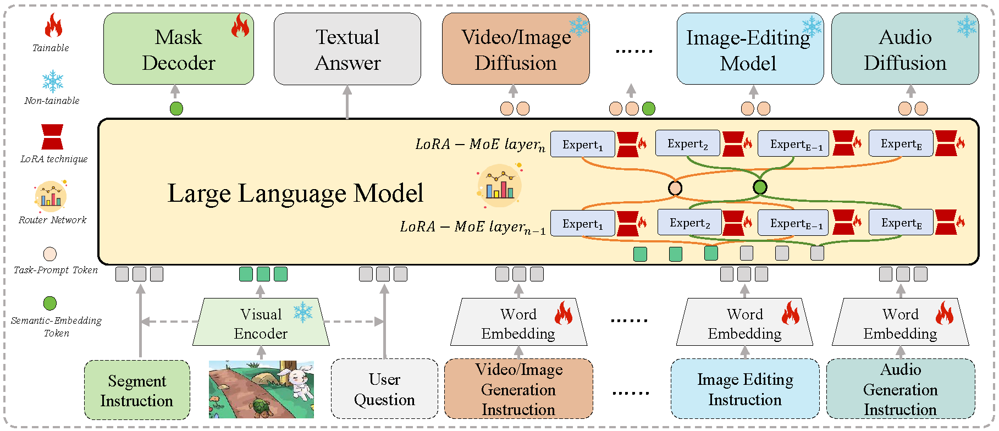
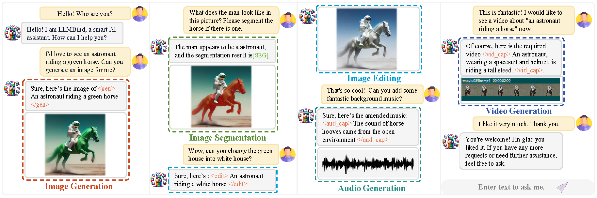
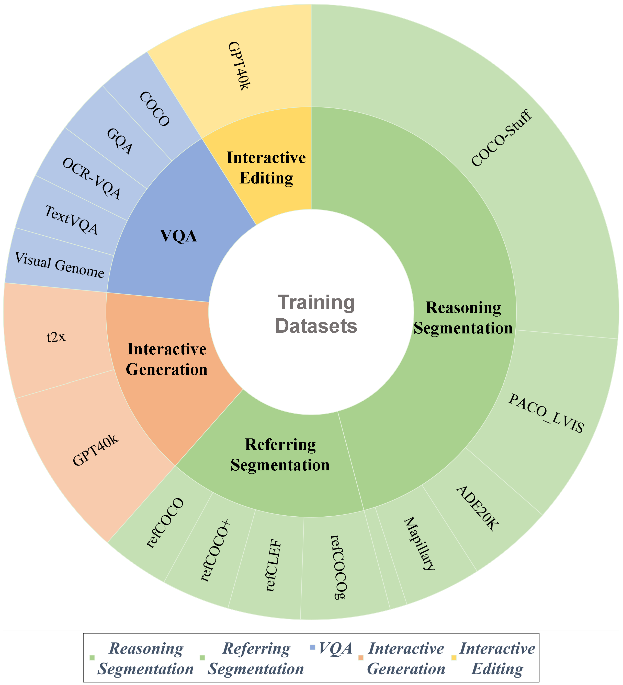
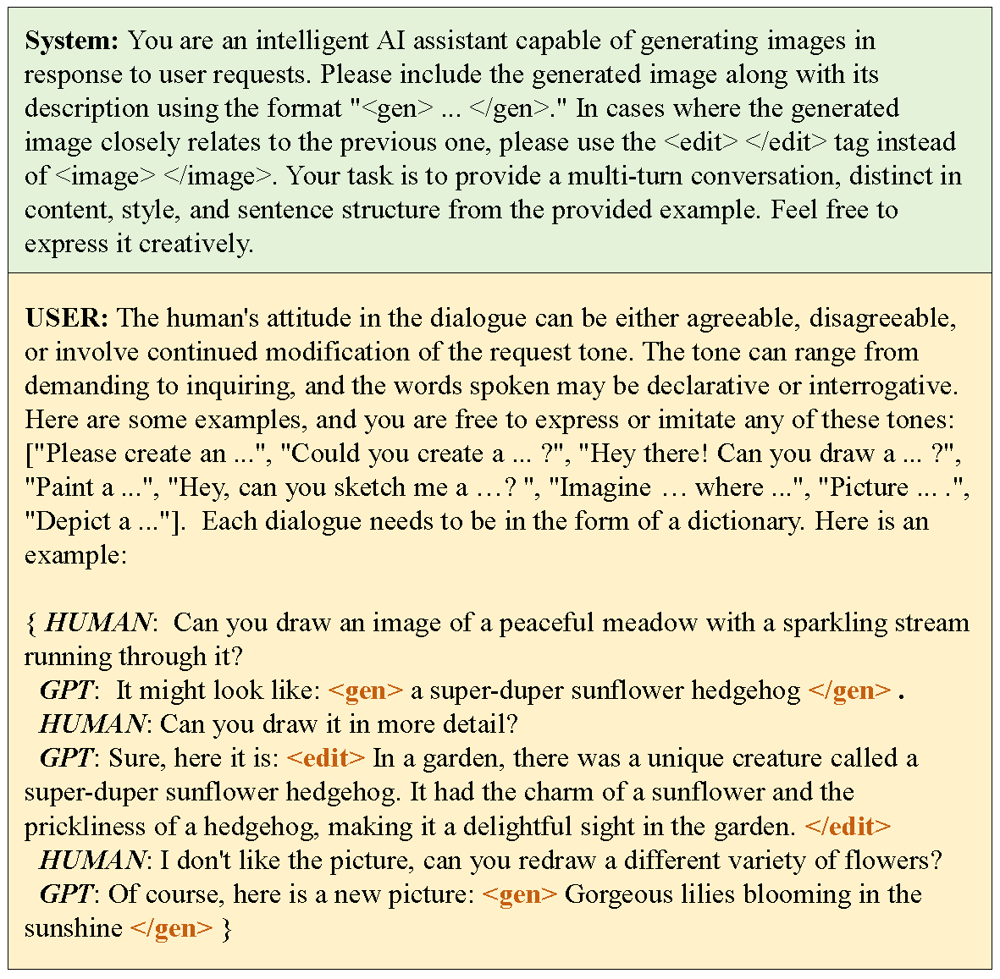

<p align="center">
    
<p>
<h2 align="center"> <a href="https://arxiv.org/abs/2402.14891">LLMBind: A Unified Modality-Task Integration Framework</a></h2>
<h5 align="center"> If you like our project, please give us a star ⭐ on GitHub for latest update.  </h2>

<h5 align="center">
    


[](https://arxiv.org/abs/2402.14891) 
[](https://github.com/PKU-YuanGroup/LLMBind/blob/main/LICENSE) 
[](https://hits.seeyoufarm.com)
[](https://github.com/PKU-YuanGroup/LLMBind/issues?q=is%3Aopen+is%3Aissue)
[](https://github.com/PKU-YuanGroup/LLMBind/issues?q=is%3Aissue+is%3Aclosed)  <br>
</h5>

<details open><summary>💡 I also have other multi-modal projects that may interest you ✨. </summary><p>
<!--  may -->
    
> [**Open-Sora-Plan**](https://github.com/PKU-YuanGroup/Open-Sora-Plan) <br>
> PKU-Yuan Lab and Tuzhan AI etc. <br>
> [](https://github.com/PKU-YuanGroup/Open-Sora-Plan)  [](https://github.com/PKU-YuanGroup/Open-Sora-Plan)  <br>
</p></details>

> [**Video-LLaVA: Learning United Visual Representation by Alignment Before Projection**](https://arxiv.org/abs/2311.10122) <br>
> Bin Lin, Yang Ye, Bin Zhu, Jiaxi Cui, Munan Ning, Peng Jin, Li Yuan <br>
[](https://github.com/PKU-YuanGroup/Video-LLaVA)  [](https://github.com/PKU-YuanGroup/Video-LLaVA) [](https://arxiv.org/abs/2311.10122) <br>

> [**LanguageBind: Extending Video-Language Pretraining to N-modality by Language-based Semantic Alignment**](https://arxiv.org/abs/2310.01852) <br>
> Bin Zhu, Bin Lin, Munan Ning, Yang Yan, Jiaxi Cui, HongFa Wang, Yatian Pang, Wenhao Jiang, Junwu Zhang, Zongwei Li, Wancai Zhang, Zhifeng Li, Wei Liu, Li Yuan <br>
[](https://github.com/PKU-YuanGroup/LanguageBind)  [](https://github.com/PKU-YuanGroup/LanguageBind)  [](https://arxiv.org/abs/2310.01852) <br>


</p></details>


## News
* **[2024.06.15]**  🤗 Huggingface demo will be available soon! Welcome to **watch** 👀 this repository for the latest updates.
* **[2024.06.15]**  🤗 We have release part of our interactive generation and editing dataset in [Huggingface](https://huggingface.co/datasets/LanguageBind/LLMBind-GPT-Interactive-Data).


## Highlights

LLMBind demonstrates promising results in advancing the development of human-like MLLM and AI agents.
### 🔥 A unified model integration framework
- We design a **unified model integration framework** that expands task-specific tokens for diverse modality tasks, thus easily integrating different tasks into a unified LLM, where we introduce the MoE technique in our framework to better handle diverse modality tasks.
<p align="center">

</p>

### 🔥 A unified MLLM with various modality tasks
- We propose **a unified MLLM** that is compatible with **various modality tasks**, including image segmentation, image generation, image editing, video generation, and audio generation.

<p align="center">

</p>


### 🔥 Interactive generation and editing datasets
- To facilitate the development of user-friendly interactive tasks, we construct a dataset of 400k interactive generation and editing multi-turn dialogues using ChatGPT. We plan to release this dataset as an open resource to foster collaborative advancements in this field.

<!-- <div style="display: flex; justify-content: center;">
  <div style="flex: 1; max-width: 40%;">
    
  </div>
  <div style="flex: 1; max-width: 40%;">
    
  </div>
</div> -->

## 1. Installation
```bash
git clone https://github.com/PKU-YuanGroup/LLMBind
cd LLMBind
conda create -n llmbind python=3.8 -y
conda activate llmbind
pip install -r requirements.txt
pip install flash-attn --no-build-isolation
```

## 2. Dataset preparation

### 2.1 Interactive generation and editing dataset: 

Download them from [LLMBind-GPT-Interactive-Data](https://huggingface.co/datasets/LanguageBind/LLMBind-GPT-Interactive-Data), and the `llmbind_dataset` folder.
```
├── llmbind_dataset
│   ├── interactive_dataset
│   │   ├── interactive_audio_t2x_format.json
│   │   ├── interactive_image_t2x_format.json
│   │   ├── interactive_video_t2x_format.json
│   │   └── interactive_generation_and_editing_format.json
```
### 2.2 Reasoning segmentation & Refering segmentation & VQA dataset: 
[Download](https://github.com/dvlab-research/LISA#dataset) them put them into the `llmbind_dataset` folder.
```
├── llmbind_dataset
│   ├── ade20k
│   │   ├── annotations
│   │   └── images
│   ├── coco
│   │   └── train2017
│   │       ├── 000000000009.jpg
│   │       └── ...
│   ├── cocostuff
│   │   └── train2017
│   │       ├── 000000000009.png
│   │       └── ...
│   ├── llava_dataset
│   │   └── llava_v1_5_mix665k.json
│   │   ├── llava_instruct_150k.json
│   ├── mapillary
│   │   ├── config_v2.0.json
│   │   ├── testing
│   │   ├── training
│   │   └── validation
│   ├── reason_seg
│   │   └── ReasonSeg
│   │       ├── train
│   │       ├── val
│   │       └── explanatory
│   ├── refer_seg
│   │   ├── images
│   │   |   ├── saiapr_tc-12 
│   │   |   └── mscoco
│   │   |       └── images
│   │   |           └── train2014
│   │   ├── refclef
│   │   ├── refcoco
│   │   ├── refcoco+
│   │   └── refcocog
│   └── vlpart
│       ├── paco
│       │   └── annotations
│       └── pascal_part
│           ├── train.json
│           └── VOCdevkit
```

## 3. Pre-trained weights

### 3.1 LLaVA weights
To train LLMBind-7B, you need to follow the instruction to merge the LLaVA delta weights. Typically, we use the final weights LLaVA-Lightning-7B-v1-1 merged from liuhaotian/LLaVA-Lightning-7B-delta-v1-1. 
```
from huggingface_hub import snapshot_download
repo_name = 'liuhaotian/LLaVA-Lightning-7B-delta-v1-1'
snapshot_download(repo_id=repo_name, local_dir="models/liuhaotian/LLaVA-Lightning-7B-delta-v1-1", local_dir_use_symlinks=False, max_workers=1 )

repo_name = 'yahma/llama-7b-hf'
snapshot_download(repo_id=repo_name, local_dir="models/yahma/llama-7b-hf", local_dir_use_symlinks=False, max_workers=1 )

cd model
PATH_TO_LLAMA_7B=/storage/zhubin/LLMBind/models/yahma/llama-7b-hf
PATH_TO_LLAVA_DELTA=/storage/zhubin/LLMBind/models/liuhaotian/LLaVA-Lightning-7B-delta-v1-1
TARGET_PATH=models/LLaVA-7B-v1-1
python3 -m model.apply_delta \
    --base $PATH_TO_LLAMA_7B \
    --target $TARGET_PATH  \
    --delta $PATH_TO_LLAVA_DELTA
```

### 3.2 SAM weights
Download SAM ViT-H pre-trained weights from [sam_vit_h_4b8939.pth](https://dl.fbaipublicfiles.com/segment_anything/sam_vit_h_4b8939.pth)


## 4. Training 

```
PATH_TO_LLaVA="PATH_TO_LLaVA"
PATH_TO_SAM="PATH_TO_SAM"
deepspeed --include localhost:0,1,2,3,4,5,6,7,8 train_ds.py \
  --version=$PATH_TO_LLaVA \
  --dataset_dir='./llmbind_dataset' \
  --vision_pretrained=$PATH_TO_SAM \
  --dataset="sem_seg||refer_seg||vqa||reason_seg" \
  --sample_rates="9,3,3,1" \
  --exp_name="llmbind-7b" \
  --steps_per_epoch 500 \
  --epochs 10 \
  --batch_size  16 \
  --model_max_length  768 \
  --add_generation_token \
  --add_edit_token \
  --add_video_generation_token \
  --add_audio_generation_token \
  --vqa_sample_rates='2,70,70,70' \
  --vqa_data "interactive_generation_and_editing_format.json||interactive_video_t2x_format||interactive_image_t2x_format||interactive_audio_t2x_format" \
```


### 5.1 Merge LoRA Weight
When training is finished, to get the full model weight:
```
cd ./runs/llmbind-7b/ckpt_model && python zero_to_fp32.py . ../pytorch_model.bin
```
Merge the LoRA weights of `pytorch_model.bin`, save the resulting model into your desired path in the Hugging Face format:
```
CUDA_VISIBLE_DEVICES="" python merge_lora_weights_and_save_hf_model.py \
  --version="PATH_TO_LLaVA" \
  --weight="PATH_TO_pytorch_model.bin" \
  --save_path="PATH_TO_SAVED_MODEL"
```
## 6. Inference

- To chat with LLMBind:
```
CUDA_VISIBLE_DEVICES=0 python chat.py --version="PATH_TO_SAVED_HF_MODEL"
```

For example:
```
HF_DATASETS_OFFLINES=1 CUDA_VISIBLE_DEVICES=7 python chat.py --version="runs/llmbind-7b/hf_weights"
```

## Acknowledgement 
-  This work is built upon the [LLaVA](https://github.com/haotian-liu/LLaVA), [SAM](https://github.com/facebookresearch/segment-anything) and [LISA](https://github.com/dvlab-research/LISA). 

## License
* The majority of this project is released under the Apache 2.0 license as found in the [LICENSE](https://github.com/PKU-YuanGroup/LLMBind/blob/main/LICENSE) file.
* The service is a research preview intended for non-commercial use only, subject to the model [License](https://github.com/facebookresearch/llama/blob/main/MODEL_CARD.md) of LLaMA, [Terms of Use](https://openai.com/policies/terms-of-use) of the data generated by OpenAI, and [Privacy Practices](https://chrome.google.com/webstore/detail/sharegpt-share-your-chatg/daiacboceoaocpibfodeljbdfacokfjb) of ShareGPT. Please contact us if you find any potential violation.


## Citation
If you find our paper and code useful in your research, please consider giving a star :star: and citation :pencil:.


```BibTeX
@article{zhu2024llmbind,
  title={LLMBind: A Unified Modality-Task Integration Framework},
  author={Zhu, Bin and Jin, Peng and Ning, Munan and Lin, Bin and Huang, Jinfa and Song, Qi and Pan, Mingjun and Yuan, Li},
  journal={arXiv preprint arXiv:2402.14891},
  year={2024}
}
```


<!-- ## Star History
[](https://star-history.com/#PKU-YuanGroup/LLMBind&Date) -->

## 🤝 Contributors

<a href="https://github.com/PKU-YuanGroup/LLMBind/graphs/contributors">
  
</a> 
